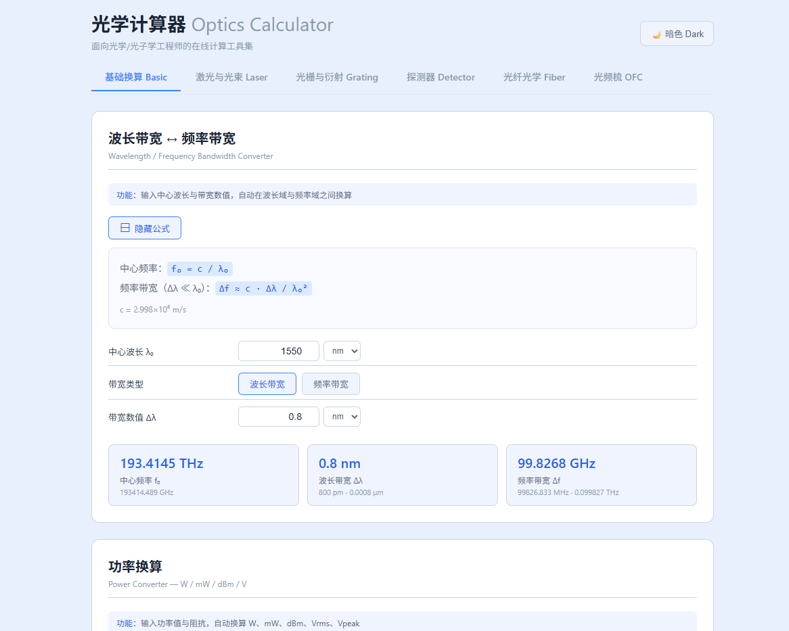
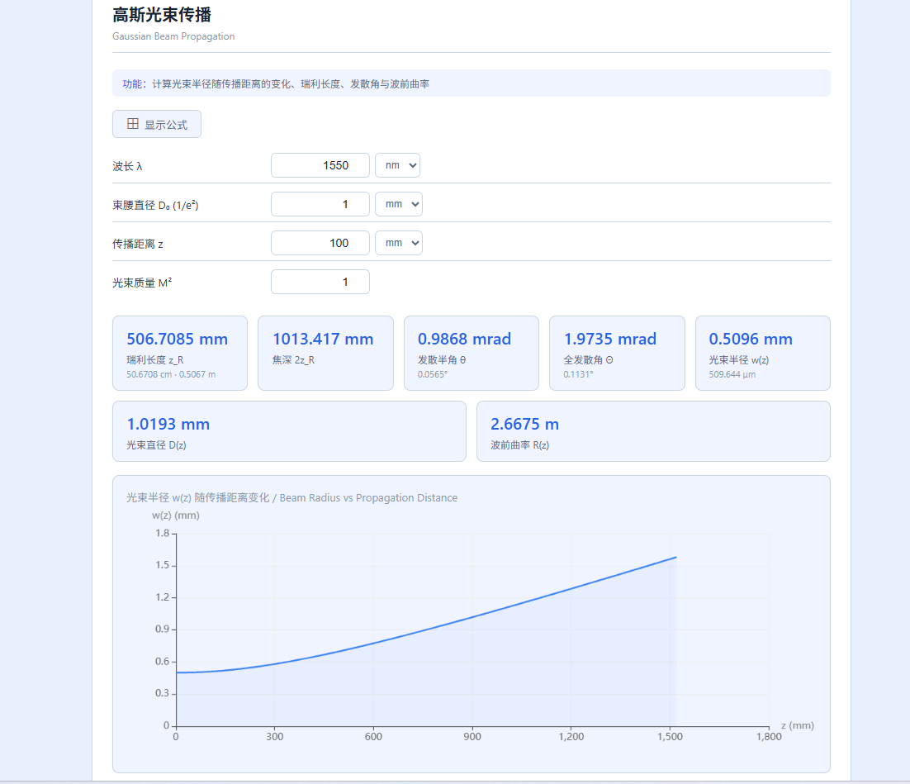

# 光学计算器 · Optics Calculator

使用 Vue 3 编写的光学计算工具，集成了常见的计算场景，直接跑在浏览器里，不用装 Matlab 或 Python。

已部署到 Vercel：[https://optics-calculator.vercel.app](https://optics-calculator.vercel.app/)，可以直接打开网站运行

---

## 能做啥

六个分类，十几个模块，基本覆盖光电方向日常碰到的计算：

**基础换算** — 波长带宽和频率带宽互转，光功率（W、dBm、V）换算。  
**激光与光束** — 高斯光束传播（给束腰算发散角、瑞利长度、光斑大小），透镜聚焦光斑大小，M² 和 BPP，连续光/脉冲的功率密度和能流密度。  
**光栅与衍射** — 光栅方程算衍射角和角色散，给定两波长算空间分离量，F-P 标准具的 FSR、精细度、FWHM。  
**探测器** — 响应度和探测率，PIN 和 APD 的噪声/SNR（散粒噪声 + 热噪声 + 暗电流）。APD 部分内置了 Si / InGaAs / Ge 的典型 k 值，切类型自动换参数。  
**光纤光学** — 传输延迟、衰减链路预算、模场失配和横向偏移的耦合损耗、SMF-28 色散 D/β₂（支持自定义零色散波长）。  
**光频梳** — 梳齿频率计算，拍频方程自动推导（选一个未知量，填四个已知量自动算）。支持近似模式（给个大概的光频反推梳齿序号）。

每个模块都带公式显示开关，点一下展开当前模块用的公式，方便核对。



## 本地运行

需要 Node.js（推荐 v18 以上）和 npm。

```bash
# 克隆仓库
git clone https://github.com/gaoyiming37/optics-calculator.git
cd optics-calculator

# 安装依赖
npm install

# 启动开发服务器
npm run dev
```

浏览器打开 `http://localhost:5173`。纯前端，没有后端服务。

## 构建与部署

```bash
# 构建生产版本
npm run build

# 本地预览构建结果
npm run preview
```

构建产物在 `dist/` 目录，部署到任何静态托管服务（Vercel、Netlify、GitHub Pages、Nginx 等）都能直接运行。

## 技术栈

- Vue 3（Composition API + `<script setup>`）
- Vite
- ECharts（交互图表）
- KaTeX（公式渲染）
- localStorage（状态持久化）



## 项目结构

```
src/
  components/shared/      通用组件，六个
    ModuleCard, OutputCard, InputGroup, FormulaToggle, ChartPanel, TabNav
  composables/            工具函数
    usePersistState.js    模块输入自动存 localStorage，刷新不丢
    useFormula.js         i18n 标题集中查询
  modules/                六个子目录，分别对应六个 tab
    BasicConversion/      4 个模块
    LaserBeam/            4 个
    GratingDiffraction/   3 个
    Detectors/            2 个
    FiberOptics/          4 个
    FrequencyComb/        2 个
  utils/
    formulas.js           所有计算函数，五百多行
    constants.js          光速、元电荷、玻尔兹曼常数
  views/                  tab 页容器
  style.css               全局主题变量（亮/暗两套）
```

## 实现细节

- OutputCard 点一下复制结果到剪贴板，右上角跳出"已复制"的动画提示。
- 暗色模式存 localStorage，下次打开保持。
- 除零保护（M²=0 时自动置 1，负载电阻=0 时兜底 1Ω 等）。
- 三个图表（高斯光束、透镜聚焦、噪声谱）的主题色跟随亮暗模式自动切换。
- APD 的过量噪声因子：F = k·M + (1−k)·(2−1/M)。
- 光频梳拍频支持五个参数任选一个做未知量推导，其他四个填已知值。
